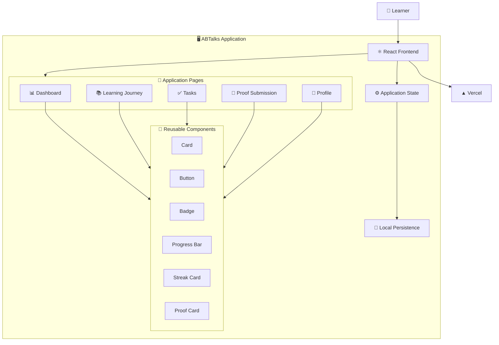
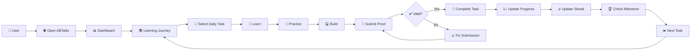
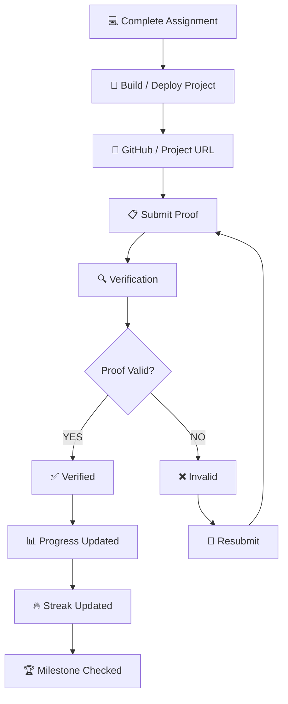
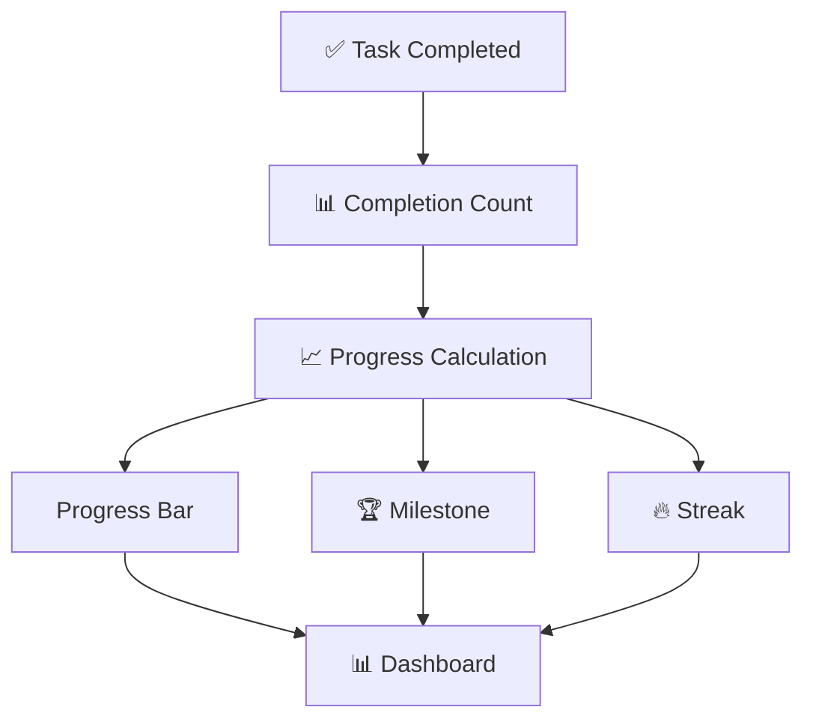
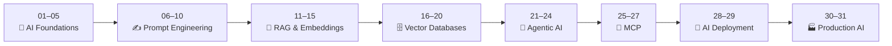
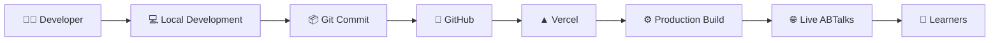
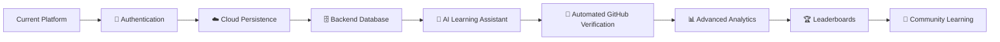
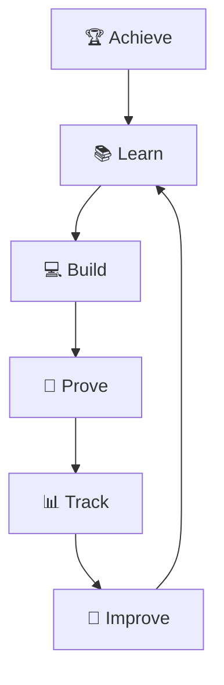

# 🚀 ABTalks — AI Learning & Progress OS

<p align="center">
  
  
  
  
  
</p>

<p align="center">
  <strong>Learn. Build. Prove. Progress.</strong>
</p>

<p align="center">
  A modern, proof-driven learning platform designed to turn an AI engineering curriculum into a measurable and engaging learning journey.
</p>

<p align="center">

🌐 **[Live Demo](https://ab-talks-ps1.vercel.app/)**

</p>

---

## 🧠 What is ABTalks?

**ABTalks** is a gamified AI-learning platform built around a structured **31-day AI Engineering journey**.

Instead of simply consuming educational content, learners follow a complete loop:

> **Learn → Practice → Build → Submit Proof → Track Progress → Repeat**

The platform combines **learning management, progress tracking, streaks, milestones, and proof-of-work verification** into one unified experience.

---

# ✨ Core Features

<table>
<tr>
<td width="50%">

### 📊 Smart Dashboard

A centralized dashboard for:

* Learning progress
* Completed tasks
* Pending activities
* Current streak
* Milestones
* Overall completion

</td>

<td width="50%">

### 📚 Structured Learning

A day-by-day learning journey that guides users through the complete AI engineering roadmap.

</td>
</tr>

<tr>
<td width="50%">

### 🔥 Streak System

Encourages consistency by tracking consecutive learning activity.

</td>

<td width="50%">

### 🏆 Milestones

Visual milestone tracking helps learners understand how far they have progressed.

</td>
</tr>

<tr>
<td width="50%">

### 🔗 Proof of Work

Learners can submit GitHub/project URLs as evidence of completed work.

</td>

<td width="50%">

### 👤 Learner Profile

A personalized profile for tracking learner identity, progress, and achievements.

</td>
</tr>

<tr>
<td width="50%">

### ⚡ Responsive UI

Designed for a clean experience across different screen sizes.

</td>

<td width="50%">

### 🎨 Modern Product Design

Reusable cards, badges, progress indicators, icons, and interactive components create a modern learning experience.

</td>
</tr>
</table>

---

# 🎯 The Problem

Traditional online learning often follows:

```text
Watch Course → Take Notes → Move On
```

This creates a gap between **learning concepts** and **actually demonstrating them**.

Learners may finish courses without having:

* Built practical projects
* Maintained consistency
* Tracked meaningful progress
* Collected evidence of their work

---

# 💡 The ABTalks Solution

ABTalks transforms passive learning into a proof-driven workflow:

```text
       📚 LEARN
          ↓
       🧠 PRACTICE
          ↓
       💻 BUILD
          ↓
       🔗 PROVE
          ↓
       📊 TRACK
          ↓
       🏆 ACHIEVE
```

The platform encourages learners to turn every learning milestone into **practical, verifiable progress**.

---

# 🏗️ System Architecture



---

# 🔄 Complete User Workflow



---

# 🔗 Proof-of-Work Workflow

A major part of ABTalks is converting learning into **verifiable work**.



---

# 📈 Progress Tracking

Every completed task contributes to the learner's overall journey.



---

# 🗺️ 31-Day AI Engineering Journey

The platform organizes the learning journey into progressive AI engineering concepts.



---

# 🧩 Learning Philosophy

ABTalks is built around three principles:

### 01 — Learn by Doing

Every concept should lead toward practical implementation.

### 02 — Proof Over Promises

Completion should be supported by actual evidence of work.

### 03 — Consistency Creates Progress

Streaks, milestones, and progress indicators encourage learners to maintain momentum.

---

# 🎨 Product Design

The UI focuses on:

| Principle         | Implementation                            |
| ----------------- | ----------------------------------------- |
| 🎯 Clarity        | Clear information hierarchy               |
| 📊 Feedback       | Progress bars, badges & completion states |
| 🧩 Reusability    | Modular React components                  |
| ⚡ Interaction     | Interactive controls and states           |
| 🎨 Consistency    | Unified visual language                   |
| 📱 Responsiveness | Responsive layouts                        |

---

# 🛠️ Tech Stack

### Frontend

<p>


</p>

### UI & Icons

<p>


</p>

### Development

<p>


</p>

### Deployment

<p>

</p>

---

# 📁 Project Structure

```text
ABTalks/
│
├── public/
│
├── src/
│   │
│   ├── Components/
│   │   ├── Badge.jsx
│   │   ├── Button.jsx
│   │   ├── Card.jsx
│   │   ├── ProgressBar.jsx
│   │   ├── ProofCard.jsx
│   │   └── StreakCard.jsx
│   │
│   ├── Pages/
│   │   ├── Dashboard.jsx
│   │   ├── Journey.jsx
│   │   ├── Profile.jsx
│   │   └── ...
│   │
│   ├── App.jsx
│   ├── main.jsx
│   └── ...
│
├── package.json
├── vite.config.js
└── README.md
```

---

# 🚀 Getting Started

### 1️⃣ Clone the repository

```bash
git clone <your-repository-url>
```

### 2️⃣ Navigate to the project

```bash
cd ABTalks
```

### 3️⃣ Install dependencies

```bash
npm install
```

### 4️⃣ Start development server

```bash
npm run dev
```

### 5️⃣ Build for production

```bash
npm run build
```

---

# 🌐 Deployment Architecture

ABTalks is deployed on **Vercel**.



---

# 🔮 Future Roadmap



### 🚧 Planned Enhancements

* [ ] 🔐 Authentication
* [ ] ☁️ Cloud profile persistence
* [ ] 🗄️ Backend database
* [ ] 🤖 AI learning assistant
* [ ] 🔗 Automated GitHub verification
* [ ] 📊 Advanced analytics
* [ ] 🏆 Leaderboards
* [ ] 🏅 Certificates
* [ ] 🔔 Notifications
* [ ] 👥 Community learning

---

# 💡 Product Vision

ABTalks aims to evolve from a learning tracker into a complete **AI Engineering Learning OS**.



> **Learning should not end with consuming content.
> It should end with something you can build, prove, and show.**

---

# 👩‍💻 Author

## Shreya Goel

**B.Tech CSE — ABES Engineering College**

<p>
<a href="https://github.com/goelshreya3001-droid">

</a>
</p>

---

# 🌐 Live Project

<p align="center">

<a href="https://ab-talks-ps1.vercel.app/">


</a>

</p>

---

<p align="center">

### ⭐ If you like the project, consider giving it a star!

**ABTalks**

### Learn → Build → Prove → Progress 🚀

</p>
