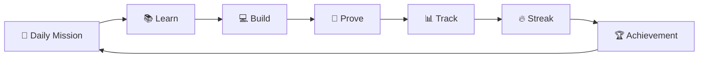
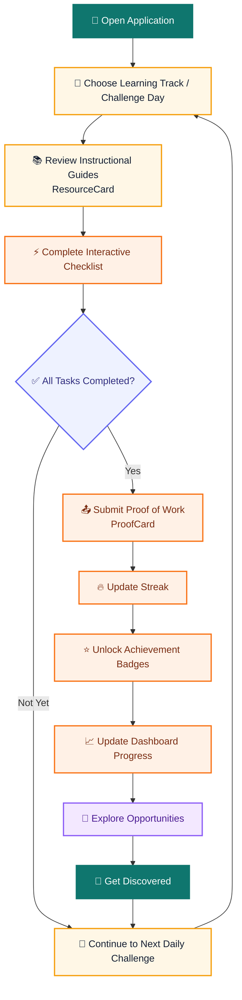
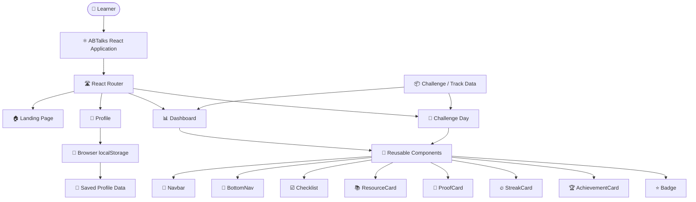
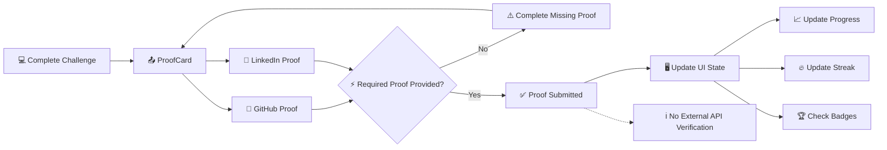
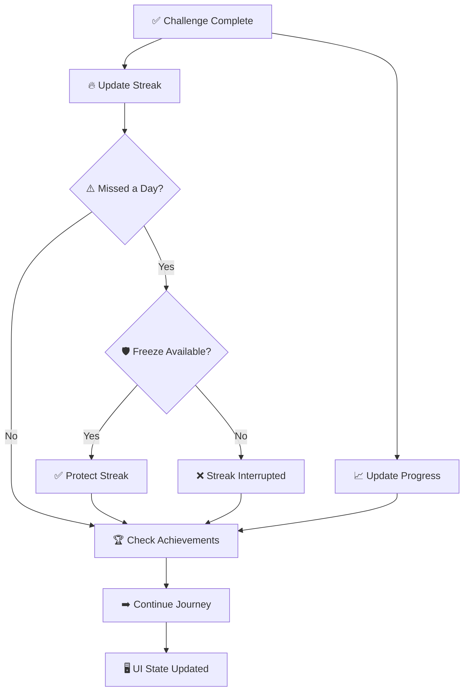
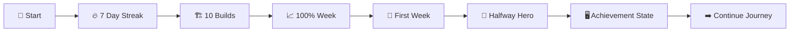
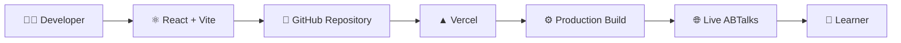
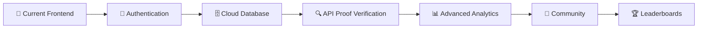

<div align="center">

# ⚡ ABTalks

### **60 Days. 60 Builds. One Consistent Journey.**

A focused coding challenge platform that helps learners  
**learn → build → prove → track → grow.**

<br/>

[](https://ab-talks-ps1.vercel.app/)
[](https://github.com/goelshreya3001-droid/Ab_talks_ps1)
[](https://react.dev/)
[](https://vite.dev/)

</div>

---

## 🎯 What is ABTalks?

ABTalks turns a coding challenge into a **visible daily journey**.

Instead of simply solving a problem and moving on, the learner:

**gets a mission → learns → builds → submits proof → tracks progress → protects the streak → unlocks milestones → continues.**

### 🔄 Core Product Loop



---

# 🌟 Why ABTalks?

ABTalks is designed around one simple idea:

> **Daily coding effort should become visible, measurable, and valuable.**

<div align="center">

| 🎯 | 🔥 | ⭐ |
|---|---|---|
| **Learn with Purpose** | **Stay Consistent** | **Show Your Growth** |
| Follow focused learning tracks and daily challenges that turn active practice into meaningful skills. | Build daily coding habits with interactive streak tracking, gamified badges, and progress milestones. | Submit proof of completion through `ProofCard` to turn your journey into visible proof of work. |

| 💼 | 🏆 | 🚀 |
|---|---|---|
| **Discover Opportunities** | **Grow Together** | **Build Your Future** |
| Connect your skills and progress with real-world opportunities. | Learn, compete, share, and grow within a student-first coding community. | Transform daily effort into proof, visibility, community recognition, and career opportunities. |

</div>

---

# 🌟 Features at a Glance

### 🎯 Structured Coding Challenges

Follow focused learning tracks and build a consistent coding habit through daily task units, difficulty tiers, and step-by-step interactive checklists using `Checklist`.

### 🔥 Streak & Progress Tracking

Maintain daily check-in streaks with `StreakCard`, evaluate completed vs. pending tasks dynamically, and track unlockable achievement milestones using `AchievementCard` and `Badge`.

### 📣 Build in Public & Proof Verification

Share project milestones and submit proof-of-work evidence through the integrated verification portal powered by `ProofCard`.

### 🤖 Learning Tracks & Embedded Guides

Explore structured learning tracks with contextual instructional material through `ResourceCard`.

### 🏆 Achievement Badges

Earn dynamic badges by completing daily challenges, maintaining streaks, and verifying completed tasks.

### 📱 Responsive Mobile UX

Experience ABTalks across devices with a persistent top navigation system through `Navbar` and a dedicated mobile navigation experience through `BottomNav`.

---

# 🧭 The ABTalks Journey

> **Learn → Build → Prove → Track → Get Discovered**

```mermaid
flowchart LR

    A["👋 JOIN<br/>ABTalks"]
    B["🎯 CHOOSE<br/>Learning Track"]
    C["⚡ BUILD<br/>Daily Challenge"]
    D["🔥 MAINTAIN<br/>Your Streak"]
    E["📤 SUBMIT<br/>Proof of Work"]
    F["📊 TRACK<br/>Your Progress"]
    G["🏆 UNLOCK<br/>Badges"]
    H["💼 DISCOVER<br/>Opportunities"]
    I["🚀 GET<br/>DISCOVERED"]

    A --> B
    B --> C
    C --> D
    D --> E
    E --> F
    F --> G
    G --> H
    H --> I

    classDef primary fill:#0F766E,stroke:#0F766E,color:#FFFFFF,stroke-width:3px;
    classDef secondary fill:#FFF7E6,stroke:#F59E0B,color:#172033,stroke-width:2px;
    classDef highlight fill:#FFF1E6,stroke:#F97316,color:#7C2D12,stroke-width:2px;
    classDef opportunity fill:#EEF2FF,stroke:#6366F1,color:#312E81,stroke-width:2px;

    class A,I primary;
    class B,C,F secondary;
    class D,E,G highlight;
    class H opportunity;
```



---

# ⚙️ Detailed User Workflow

The journey inside the application follows a continuous learning loop:



---

# 🏗️ System Architecture



---

# 🔗 Proof of Work Flow

Proof submission is a core part of the ABTalks experience.



---

# 🔥 Progress & Streak System



---

# 🏆 Achievement Journey



---

# 🛠️ Tech Stack

| Technology | Purpose |
|---|---|
| ⚛️ **React 19** | User interface |
| ⚡ **Vite 8** | Development and production build |
| 🎨 **Tailwind CSS 4** | Styling and responsive design |
| 🛣️ **React Router 7** | Client-side routing |
| 🧩 **Lucide React** | Interface icons |
| 💾 **localStorage** | Browser-based profile persistence |
| 🐙 **GitHub** | Version control |
| ▲ **Vercel** | Deployment |

---

# 🌐 Deployment Architecture



### 🚀 Live Application

**[https://ab-talks-ps1.vercel.app/](https://ab-talks-ps1.vercel.app/)**

### 💻 Repository

**[https://github.com/goelshreya3001-droid/Ab_talks_ps1](https://github.com/goelshreya3001-droid/Ab_talks_ps1)**

---

# 🎨 Design Direction

ABTalks follows a **dark, focused, action-first interface**.

| 🎯 Focus | 📊 Feedback | 🔥 Motivation | 🔗 Proof | 🧩 Modularity |
|---|---|---|---|---|
| Next action is obvious | Progress stays visible | Streaks reinforce consistency | Work has a visible outcome | Reusable UI keeps the experience consistent |

### Main UI Language

`Profile` · `Mission` · `Progress` · `Streak` · `Proof` · `Achievements`

---

# 🚀 Run Locally

### 1. Clone the repository

```bash
git clone https://github.com/goelshreya3001-droid/Ab_talks_ps1.git
```

### 2. Enter the project

```bash
cd Ab_talks_ps1
```

### 3. Install dependencies

```bash
npm install
```

### 4. Start development server

```bash
npm run dev
```

### 5. Create production build

```bash
npm run build
```

### 6. Preview production build

```bash
npm run preview
```

---

# 🗺️ Routes

| Route | Purpose |
|---|---|
| `/` | 🏠 Landing page |
| `/dashboard` | 📊 Learner dashboard |
| `/day/:dayId` | 📅 Individual challenge |

---

# 🔮 Future Scope



### Potential Extensions

- 🔐 Authentication
- ☁️ Cloud profile persistence
- 🗄️ Backend database
- 🔍 GitHub API verification
- 💼 LinkedIn integration
- 📊 Persistent analytics
- 🔔 Notifications
- 👥 Community features
- 🏆 Leaderboards

---

# 💡 Product Philosophy

> **Don't just solve code. Build evidence of consistency.**

ABTalks connects the things that usually stay separate:

```text
LEARNING
   ↓
 BUILD
   ↓
 PROVE
   ↓
 TRACK
   ↓
 GROW
```

### The goal is simple:

**Make progress visible. Make consistency rewarding.**

---

# 👩‍💻 Author

<div align="center">

### **Shreya Goel**

B.Tech CSE · ABES Engineering College

[](https://github.com/goelshreya3001-droid)

</div>

---

<div align="center">

### 🚀 [Try ABTalks Live](https://ab-talks-ps1.vercel.app/)

**60 Days · Build Daily · Prove Your Work**

</div>
