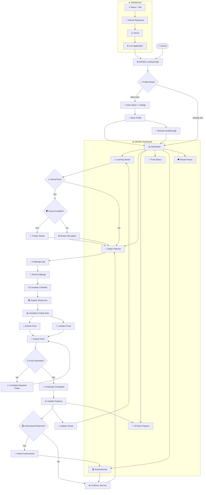
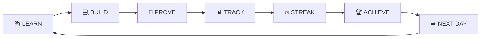

# 🔄 ABTalks — Complete System Flow

---

## 🧠 How the Entire System Connects

### The core loop

> **Learn → Build → Prove → Track → Maintain Streak → Achieve → Repeat**

This makes the product easy to understand at a glance: the learner enters through the landing page, reaches the dashboard, completes the daily challenge, submits proof, gets progress/streak feedback, reaches achievements, and returns to the next challenge.
